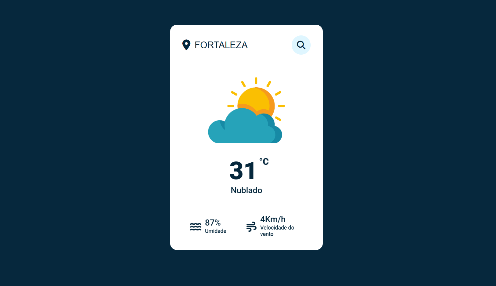

# Weather App

## Índice

- [Descrição do Projeto](#descrição-do-projeto)
- [Tecnologias Utilizadas](#tecnologias-utilizadas)

## [Descrição do Projeto](#descrição-do-projeto)

O Weather App é um projeto que oferece a pesquisa do clima da cidade, com os dados fornecidos pela API OpenWeather.

## [Tecnlogias Utilizadas](#tecnologias-utilizadas)

HTML

 

CSS

 

Javascript

 

 
